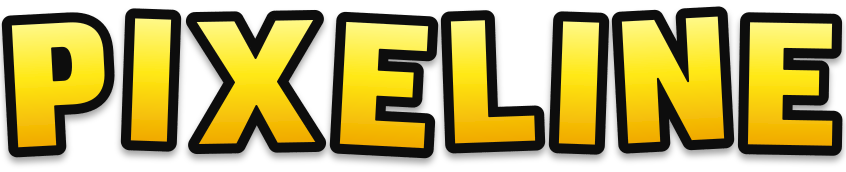
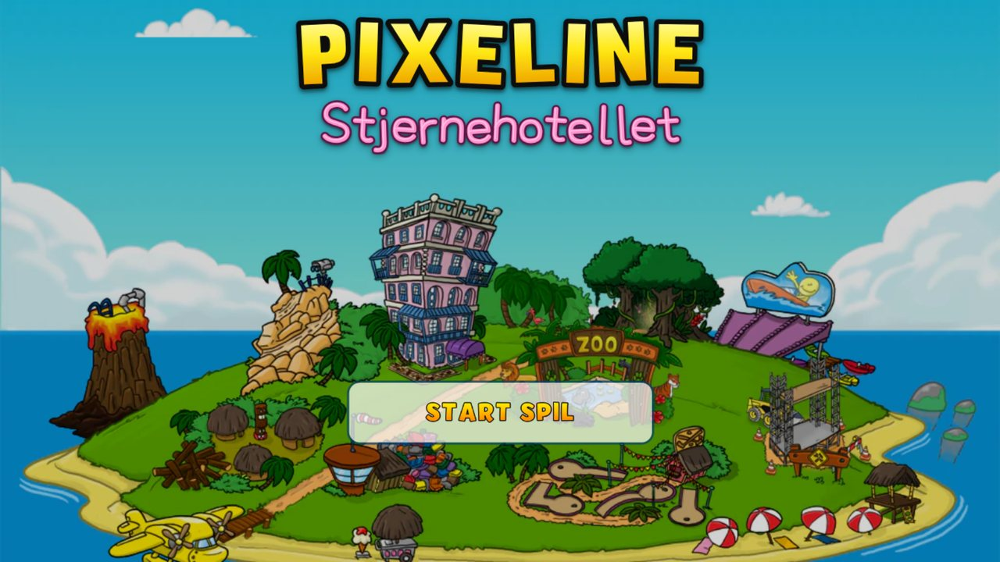
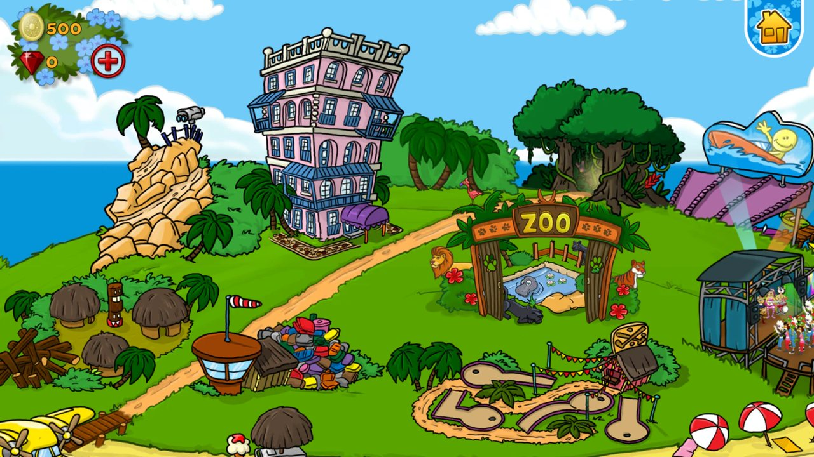
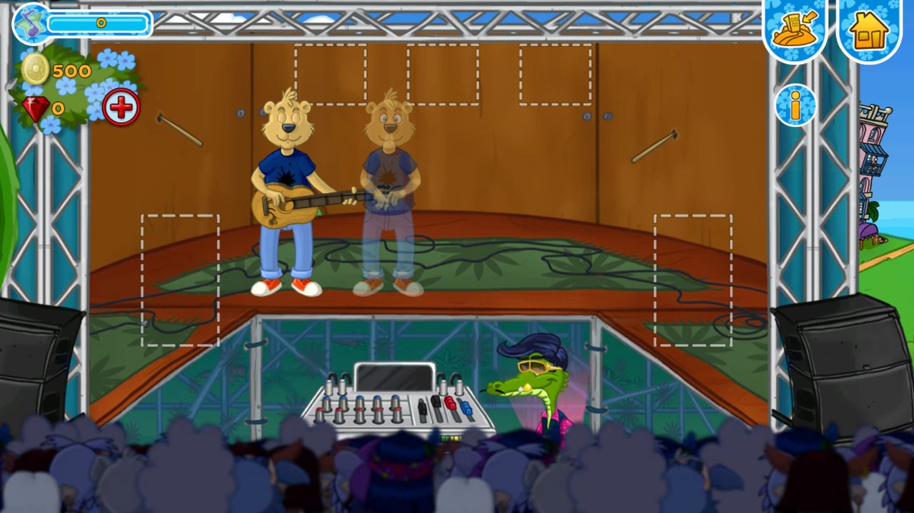
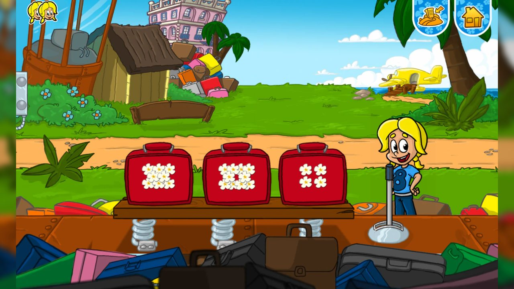
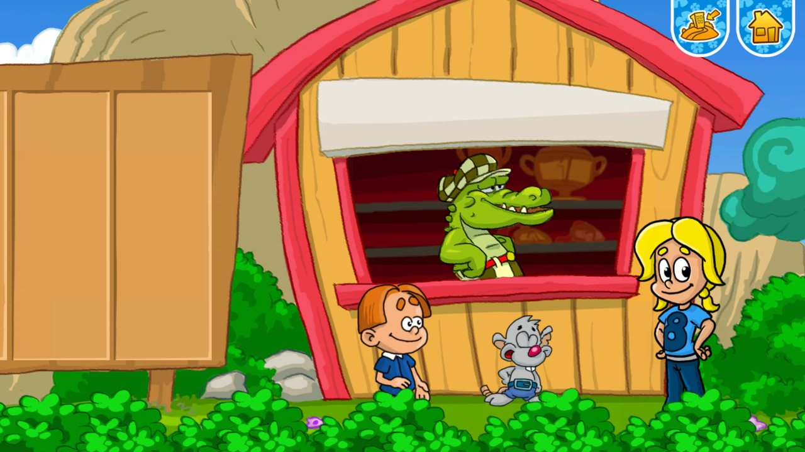
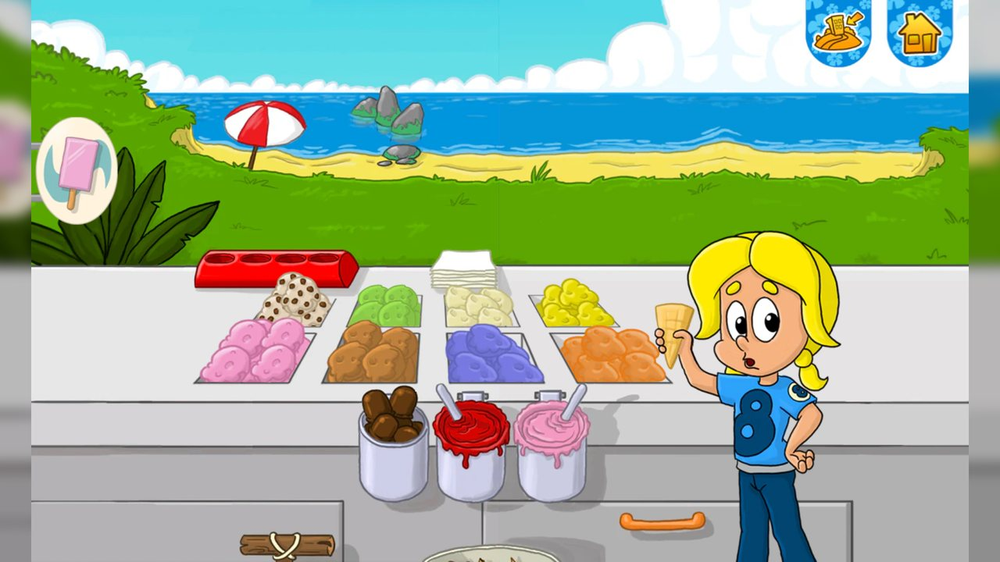
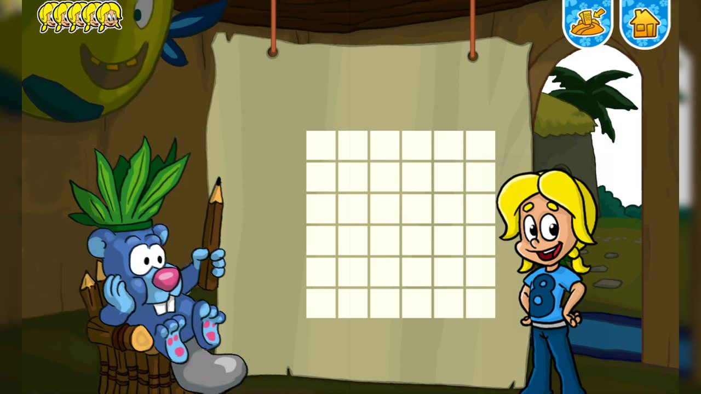
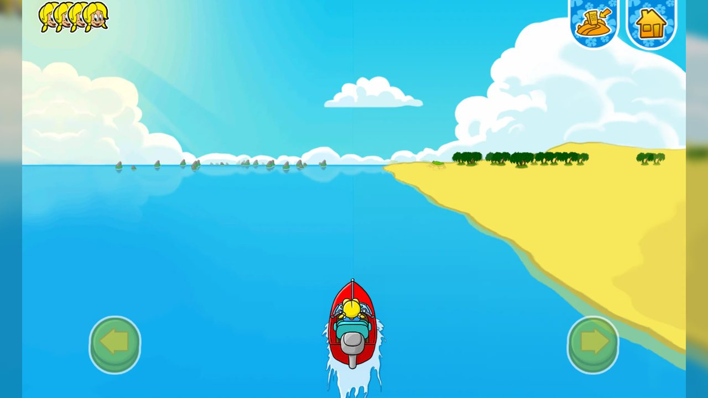
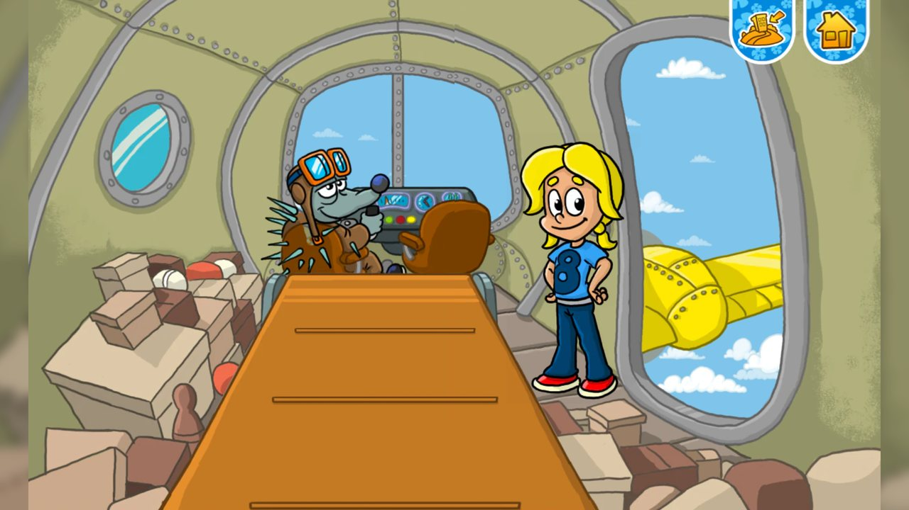

<div align="center">


<br>


### Byg dit eget hotel, tag imod gæster og spil minispillene på øen

<br>

[](https://github.com/zhiftyDK/stjernehotellet-2.0/releases/tag/v0.0.1)


[](https://github.com/zhiftyDK/stjernehotellet-2.0/releases)


<br>



</div>

---

## Om projektet

**Pixeline – Stjernehotellet** er et lille, kærligt **fanprojekt**. Det er en genskabelse af det gamle Pixeline-spil, lavet for at **bevare** det og **moderniseret** så det kan spilles i en almindelig browser eller som et selvstændigt program på computeren.

> [!IMPORTANT]
> **Dette er ikke det officielle spil.** Projektet er ikke tilknyttet, godkendt eller støttet af de oprindelige rettighedshavere. Se afsnittet [Ophavsret og rettigheder](#ophavsret-og-rettigheder).

## Det kan du i spillet

- 🏨 **Byg og indret dit hotel** – etager, møbler og gæster, og tjen penge undervejs.
- 🌴 **Udforsk øen** – træk rundt på kortet og besøg zoo'en, scenen, minigolfbanen og de andre steder.
- 🎮 **Spil 12 minispil** – fra detektivarbejde med kikkert til popband og speedbåde.
- 💾 **Flere gemte spil** – op til 8 spillere, som du frit kan oprette, skifte imellem og slette.
- 🏠 **Hovedmenu overalt** – hus-skiltet øverst til højre er altid ved hånden, også midt i et minispil.
- 🖥️ **Hele skærmen i 16:9** – ingen sorte kanter.
- 🎵 **Musik og lyde** med lydstyrke under Indstillinger.

<div align="center">
<table>
  <tr>
    <td></td>
    <td></td>
  </tr>
  <tr>
    <td align="center"><sub>Hotellet og øen</sub></td>
    <td align="center"><sub>Popstars – bandets scene</sub></td>
  </tr>
</table>
</div>

## Minispillene

<div align="center">
<table>
  <tr>
    <td></td>
    <td></td>
    <td></td>
  </tr>
  <tr>
    <td align="center"><sub>Kuffert</sub></td>
    <td align="center"><sub>Golf</sub></td>
    <td align="center"><sub>Is</sub></td>
  </tr>
  <tr>
    <td></td>
    <td></td>
    <td></td>
  </tr>
  <tr>
    <td align="center"><sub>Picross</sub></td>
    <td align="center"><sub>Båd</sub></td>
    <td align="center"><sub>Luftpost</sub></td>
  </tr>
</table>
</div>

| | Minispil | | Minispil |
|:-:|---|:-:|---|
| 1 | Findting | 7 | Byttespil |
| 2 | Sortering | 8 | Picross |
| 3 | Luftpost | 9 | Båd |
| 4 | Kuffert | 10 | Platform |
| 5 | Golf | 11 | Zoo |
| 6 | Is | 12 | Popstars |

## Kom i gang

Spillet er skrevet i almindelig HTML, CSS og JavaScript (ES-moduler). Selve spillet i `src/` kan køres uden build – ret en fil, genindlæs siden, og du kan se ændringen. Et build-trin (valgfrit) laver en hurtig, minificeret version og Windows-programmet.

### Kør det lokalt

```bash
npm install          # første gang
npm run serve        # serverer src/ på http://127.0.0.1:5500
```

(Browsere tillader ikke ES-moduler direkte fra `file://`, derfor skal der en lille webserver til. Du kan også bruge *Live Server* i VS Code på mappen `src/`.)

### Byg

```bash
npm run build web        # hjemmeside        ->  dist/web/
npm run build windows    # Windows-program + installer  ->  dist/app/ og dist/installer/Stjernehotellet-Setup.exe
```

- `build web` samler og minificerer JavaScript med esbuild og kopierer resten af spillet. Læg indholdet af `dist/web/` på en webserver.
- `build windows` pakker spillet i Electron og laver derefter installationsprogrammet med [Inno Setup 6](https://jrsoftware.org/isinfo.php) (`winget install JRSoftware.InnoSetup`). Er Inno Setup ikke installeret, får du stadig programmet i `dist/app/`.
- Vil du teste Electron-udgaven uden at bygge: `npm start`.

### Som programmet på computeren (Electron)

Her ligger gemte spil i en fil (`saves.json`) i programmets brugermappe, så de ikke afhænger af, hvilken port spillet kører på.

## Gemte spil

| Hvor spillet køres | Hvor dine spil gemmes |
|---|---|
| **I browseren** (website) | Browserens `localStorage` for adressen, du spiller på |
| **Som program** (Electron) | `saves.json` i programmets brugermappe, med en sikkerhedskopi (`saves.json.bak`) |

> [!NOTE]
> Gemte spil i browseren hører til den browser og den adresse, du spiller på. Sletter du browserens data, forsvinder de.

## Projektets opbygning

```text
src/                Selve spillet (alt det, browseren henter)
├─ index.html       Siden
├─ css/, custom.css Typografi og layout
├─ img/             Logoer (vektor-SVG)
├─ profil/          Profilbillede og talebobler
├─ data/            Spildata: billeder, lyd og animationer
└─ js/
   ├─ main.js       Indgang
   ├─ ui/           App og menuer
   ├─ screens/      Startskærm og hovedskærm
   ├─ game/         Hotel, verden og spillogik
   ├─ engine/       Animation, tweens og konstanter
   ├─ render/       Tegning på canvas
   ├─ audio/        Lyd og musik
   ├─ storage/      Gemte spil
   └─ minigames/    De 12 minispil
electron/           Windows-programmet (hovedproces, preload, ikoner)
installer/          Inno Setup-script til installationsprogrammet
scripts/            Build-kommandoerne (npm run build web / windows) og testserver
docs/               Billeder og teknisk dokumentation
dist/               Byggeresultat (oprettes af build, ikke i git)
```

## Ophavsret og rettigheder

Dette er et **uofficielt fanprojekt**, lavet af kærlighed til det oprindelige spil – ikke for at tjene penge.

- **Pixeline**, **Stjernehotellet** og alle tilhørende figurer, tegninger, lyde, musik, tekster og andet indhold tilhører **de oprindelige rettighedshavere**. Alle rettigheder forbeholdes dem.
- Projektet er **ikke** tilknyttet, godkendt eller sponsoreret af rettighedshaverne.
- Spillet er genskabt med det formål at **bevare** et stykke dansk børnespilhistorie og at **modernisere** det, så det stadig kan spilles i dag.
- Ønsker en rettighedshaver, at noget fjernes, respekteres det naturligvis.

Logoerne i `img/` er tegnet på ny som vektorer og er ikke de originale logofiler.

---

<div align="center">
<sub>Lavet med kærlighed til Pixeline 💛</sub>
</div>
